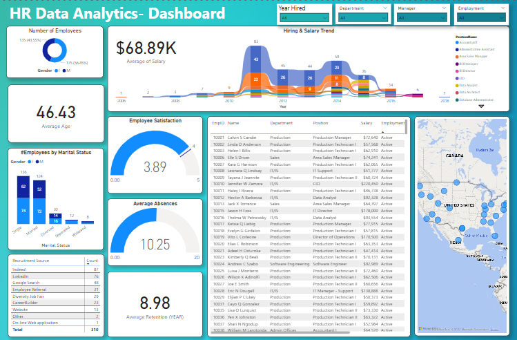

# **HR Data Analytics Dashboard**

This project demonstrates the development of a comprehensive **HR analytics dashboard** designed to analyze workforce data and provide actionable insights for better decision-making. By combining **SQL** for data cleaning and transformation with **Power BI** for visualization, the project showcases the ability to extract meaningful trends and patterns from raw **HR datasets** using **MS SQL Server** and **SQL Server Management Studio (SSMS)**.

---

## **Objectives**
The project aims to derive actionable insights into workforce dynamics by analyzing:
- **Retention Trends**: Average employee tenure and reasons for termination.
- **Satisfaction Levels**: Engagement and satisfaction scores across departments.
- **Hiring Patterns**: Salary trends and demographics of new hires.
- **Absence Metrics**: Employee absence rates and their impact.
- **Diversity Metrics**: Gender, marital status, and geographic distribution.

---

## **Key Features**

### **Data Preparation** (SQL with MS SQL Server & SSMS)
- Cleaned and standardized employee data:
  - Handled missing values and duplicate entries.
  - Standardized employee names (capitalization and formatting).
- Created calculated fields for enhanced reporting:
  - **Full Name**, **Department Name**, and **Position Name** using SQL joins.
- Validated data integrity (e.g., counting `NULL` values and duplicates).

### **Dashboard Development** (Power BI)
- **KPIs**: Average salary, retention period, and satisfaction levels.
- **Interactive Filters**: Year hired, department, manager, and employment status.
- **Visuals**:
  - Hiring and salary trends over time.
  - Employee satisfaction and absence metrics.
  - Demographics by gender, marital status, and location.

---

## **Technologies**
- **MS SQL Server & SSMS**: Data storage, cleaning, and transformation.
- **Power BI Desktop**: For building and visualizing dashboards.
- **GitHub**: For version control.

---

## **Dashboard Preview**

1. **Dashboard**
   
)

2. **Dashboard - Data For Year 2011**
   

3.**Dashboard - Active Employees in Production Department**

